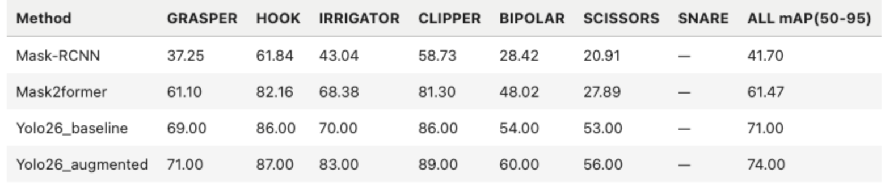
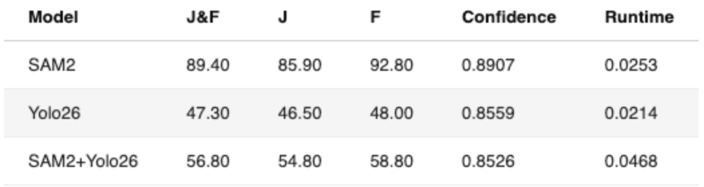

# CSCI E-25 Computer Vision: YOLO26-SAM2 Surgical Tool Instance Segmentation for Laparoscopic Surgery¶

Cristina Kennedy, BSN, RN

May 2026

## Introduction

As the surgical field advances and minimally invasive surgeries, including robotic surgeries, become more common, there is a new opportunity to create semi-autonomous or even autonomous surgical systems. Precise instance segmentation of surgical tools is essential to achieving this goal.

This project proposes developing an end-to-end computer vision pipeline that accurately segments surgical instruments in laparoscopic cholecystectomy (gallbladder removal) video frames to support computer-assisted surgical interventions. I would like to investigate the extent to which fine-tuning YOLO26 model can achieve high instance segmentation accuracy across all laparoscopic surgical tool classes, including rare and visually similar instruments, compared to Mask R-CNN and Mask2Former models used in the initial study. I would also like to explore how class imbalance among surgical tool categories affects per-class segmentation performance, and to what extent targeted augmentation strategies can mitigate this effect.

I also included SAM2 specifically for its high-quality masks, fine-tuning, and its compatibility with YOLO26. Although these two models can't be benchmarked using the same metrics in a traditional sense, they are able to work together to combine localization and mask quality.

## Dataset Description

The CholecInstanceSeg dataset is a surgical tool instance segmentation dataset comprising 41,933 annotated frames extracted from 85 laparoscopic cholecystectomy procedures, with 64,400 tool instances, each labeled with a semantic mask and an instance ID, across seven instrument classes:

Grasper
Bipolar
Hook
Clipper
Scissors
Irrigator
Snare.
A comprehensive assessment of the dataset, including the labeling process, can be found in the Nature paper published alongside it. According to Synapse, this is the largest open-access tool instance segmentation dataset to date. CholecInstanceSeg is well-suited for this project, as it provides instance-level annotations, which are critical given the goal of instance segmentation. Training on pixel-level instance masks directly aligns with what YOLO26-seg is optimized to learn. The dataset comes with predefined train/val/test splits as specified by the dataset authors. These splits are used as-is, following the authors' recommendation to preserve the intended data distribution:

Train set: 26830 images
Val set: 4284 images
Test set: 10819 images.

## Results
### Part 1
One of my goals was to compare how YOLO26 does against Mask-RCNN and Mask2former models from the original study. The evaluation metric used across all models is mAP(50-95). The YOLO26 models are fine-tuned on the CholeInstanceSeg dataset: yolo_baseline as-is, and yolo_augmented upgraded with a custom augmentation pipeline.

The first fine-tuned YOLO26 yolo_baseline I used as a baseline model already did much better than both models tested in the original study. For yolo26_augmented, I added a custom augmentation pipeline that outperformed all 3 models. The greatest improvements can be seen particularly in the classes with less data.

### Part 2
One of the challenges I encountered was making a fair comparison between the SAM2 and YOLO26 (yolo_augmented), since both models produce different native inference metrics. The easiest path for me was to evaluate both using the SAM2's own sav_evaluator. It compares the predicted mask colored by index, called palette PNGs, to the ground truth palette PNGs. Since SAM2 already predicts in that format, all I needed to do was export YOLO26's outputs as palette PNGs, at which point the same evaluator could score both models on the same metrics. All three models were evaluated on the same test dataset.

SAM2 did significantly better than YOLO26 in segmentation quality, at the cost of slightly slower inference time. I had high hopes for the SAM2+Yolo26 model, but it performed worse compared to SAM2 alone, while being twice as slow.
